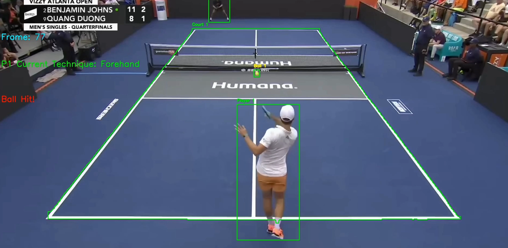

# PicklePal

PicklePal is a computer vision and deep learning based application for analyzing pickleball matches from video. The project detects and tracks players, the ball, court, and classifies player shots and techniques using pose estimation and a PyTorch neural net trained on keypoints -> technique classification.

## Features

- **Player, Ball, and Court Detection:** Uses custom-trained YOLOv8 models to detect and track players, the ball, and the court in video frames.
- **Pose Estimation & Classification:** Utilizes MediaPipe to extract player poses and classify shots with a PyTorch model (e.g., forehand, backhand).
- **Shot Event Detection:** Identifies ball hit events and visualizes them in processed videos.

## Tools & Libraries

- **Python**
- **OpenCV** for video processing and visualization
- **MediaPipe** for pose landmark detection
- **PyTorch** for deep learning technique classification model
- **YOLOv8** for object detection
